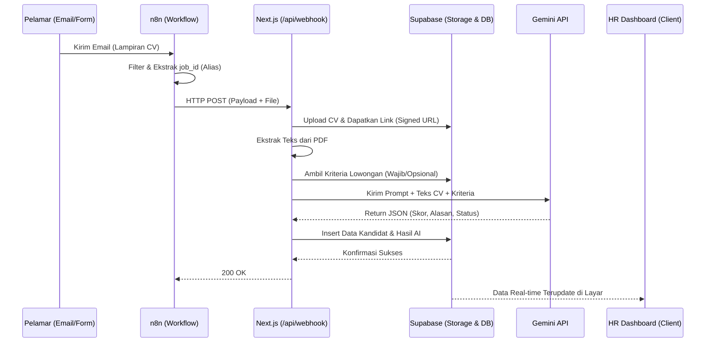
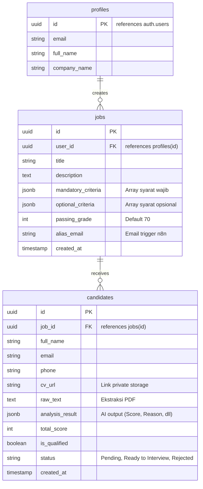

# PRD — HR Automation System

## 1. Overview
HR Automation System adalah aplikasi berbasis web yang dirancang untuk merevolusi proses rekrutmen dengan mengotomatisasi penyaringan kandidat (CV screening) secara cerdas. Masalah utama yang diselesaikan adalah waktu dan tenaga yang terbuang oleh HRD dalam menyeleksi ratusan CV secara manual. 

Sistem ini menggabungkan fleksibilitas Next.js untuk antarmuka pengguna, efisiensi **n8n** sebagai jembatan *ingestion* data dari email, dan kecerdasan **Gemini API** untuk mengekstrak dan memberikan skor pada kandidat secara otomatis berdasarkan kriteria yang ditetapkan HR. Sistem ini mendukung multi-tenant, memastikan setiap HR memiliki ruang kerja dan database kandidat yang terisolasi dan aman.

## 2. Requirements
Berikut adalah persyaratan tingkat tinggi sistem:
- **Aksesibilitas & Platform:** Aplikasi berbasis web browser (diutamakan desktop untuk dashboard HR).
- **Pengguna (User Roles):** Multi-user (Recruiters / HR Professionals). Setiap pengguna memiliki dashboard masing-masing.
- **Metode Input Data:** 1. *Otomatis:* Via Email (Gmail) yang ditangkap oleh webhook n8n menggunakan sistem email alias (misal: `rekrutmen+job123@domain.com`).
  2. *Manual:* Melalui Web Form lowongan yang disediakan sistem.
- **Mekanisme AI & Scoring:** AI mengevaluasi CV berdasarkan "Syarat Wajib", "Syarat Opsional", dan "Passing Grade". Jika syarat wajib gagal, kandidat otomatis *Not Qualified*. Jika syarat tidak ditentukan, AI memberikan skor objektif berdasarkan relevansi secara umum.
- **Privasi & Keamanan:** Data CV bersifat konfidensial. Disimpan di Private Bucket dan dilindungi oleh *Row Level Security* (RLS) di database.

## 3. Core Features & Pages Mapping
Berikut adalah pemetaan halaman web (URL Routes) beserta fitur-fitur kunci di dalamnya:

1. **`/register` & `/login` (Autentikasi)**
   - Form pendaftaran dan masuk menggunakan Email & Password (Supabase Auth).
2. **`/dashboard` (Main Analytics)**
   - **Statistik Real-time:** Menampilkan total pelamar masuk hari ini, persentase kandidat lulus vs gagal, dan grafik performa rekrutmen.
   - **Quick Actions:** Akses cepat untuk membuat lowongan baru atau melihat kandidat terbaru.
3. **`/jobs` (Manajemen Lowongan)**
   - **Daftar Lowongan:** Tabel list pekerjaan yang sedang aktif maupun ditutup.
   - **Create/Edit Job Form:** Form untuk menentukan Judul, Deskripsi, **Syarat Wajib** (Mandatory Criteria), **Syarat Opsional** (Optional Criteria), dan **Passing Grade** (misal: 70).
   - Sistem men-generate "Email Alias" dan "Link Form Publik" unik untuk setiap lowongan.
4. **`/jobs/[job_id]` (Detail Lowongan & Pipeline Kandidat)**
   - **Candidate Table:** Tabel daftar pelamar untuk lowongan spesifik.
   - **Sort "Ready to Interview":** Tombol satu klik untuk memfilter kandidat yang lulus *Mandatory Check* dan memiliki skor di atas Passing Grade.
   - **AI Insight Tooltip:** Menampilkan modal/tooltip berisi alasan ringkas (*reasoning*) mengapa AI memberikan skor tersebut tanpa harus membuka detail profil.
5. **`/candidates/[candidate_id]` (Detail Kandidat)**
   - **CV Viewer:** Menampilkan file PDF CV secara *embedded* (diakses via Signed URL Supabase).
   - **Detail Ekstraksi & AI Score:** Rincian lengkap hasil analisis Gemini (Total Score, Mandatory Check Status, Skills Found, dan kesimpulan lolos/tidaknya).
   - **Status Updater:** Dropdown untuk mengubah status kandidat secara manual ('Pending', 'Ready to Interview', 'Rejected', 'Hired').
6. **`/api/webhook/ingest` (Backend Route - Non UI)**
   - Endpoint tersembunyi yang menerima *payload* POST dari **n8n** (berisi `job_id`, `sender_email`, `subject`, dan *binary file* CV) untuk memicu proses ekstraksi teks dan pemanggilan Gemini API.

## 4. User Flow
**Alur Kerja HR (Frontend):**
1. HR melakukan Register/Login ke sistem.
2. HR membuat lowongan baru di halaman `/jobs` dan menentukan *Syarat Wajib*, *Syarat Opsional*, serta *Passing Grade*.
3. Sistem menghasilkan Email Alias (e.g., `rekrutmen+id_lowongan@gmail.com`). HR membagikan email ini di portal lowongan kerja (LinkedIn, JobStreet, dll).
4. HR memantau `/dashboard` atau `/jobs/[job_id]`. Saat data masuk, HR mengklik tombol "Ready to Interview" untuk langsung mendapatkan kandidat terbaik hasil kurasi AI.

**Alur Kerja Automasi Ingestion & AI (Background):**
1. Pelamar mengirim email berisi lampiran CV ke email alias lowongan.
2. **n8n Trigger:** Mendengarkan email masuk, memfilter email tanpa lampiran, lalu mengekstrak `job_id` dari header `To`.
3. **n8n Action:** Mengirim HTTP Request (CV & Meta Data) ke endpoint Next.js `/api/webhook/ingest`.
4. **Next.js API:** Menyimpan PDF ke Supabase Storage, mengekstrak teks PDF, lalu mengirim *Prompt* ketat ke Gemini API.
5. **Gemini API:** Menilai teks CV berdasarkan kriteria lowongan, merespons dengan JSON terstruktur (Score, Reason, Mandatory Check).
6. **Database:** Sistem menyimpan skor akhir. Dashboard HR otomatis terupdate secara real-time.

## 5. Architecture
Berikut adalah gambaran arsitektur sistem dan aliran datanya:

## 6. Database Schema
Berikut adalah struktur tabel relasional pada Supabase PostgreSQL:

| Tabel | Deskripsi |
| :--- | :--- |
| **profiles** | Data pengguna HR (multi-tenant). Berelasi langsung dengan Supabase `auth.users`. |
| **jobs** | Menyimpan data lowongan, termasuk kriteria penilaian berformat JSON dan *passing grade* untuk instruksi prompt AI. |
| **candidates** | Menyimpan profil pelamar, tautan dokumen CV aman, serta hasil skoring mentah dari Gemini API. |

## 7. Design & Technical Constraints
Sistem ini harus dibangun dengan mematuhi batasan teknis dan arsitektur berikut:

**High-Level Constraints:**
- **Strict Multi-Tenancy (RLS):** Wajib menggunakan *Row Level Security* (RLS) di Supabase. `profiles` hanya bisa mengakses datanya sendiri. `jobs` dan `candidates` difilter berdasarkan relasi ke `user_id` yang sedang login.
- **Private Storage:** Folder bucket penyimpanan CV di Supabase harus bersifat **Private**. Next.js wajib men-generate *Signed URL* berbatas waktu saat HR ingin melihat/mengunduh CV di dashboard.
- **Strict JSON AI Output:** Prompt Gemini harus memaksakan `response_mime_type: "application/json"` agar aplikasi tidak mengalami *crash* saat mem-parsing hasil skor.

**Standard Technology Defaults:**
- **Tech Stack:** Aplikasi wajib dibangun menggunakan **Next.js (App Router)**, styling menggunakan **Tailwind CSS**, dan komponen antarmuka menggunakan **shadcn/ui**.
- **Backend/AI Constraint:** WAJIB menggunakan agen internal **"Context7"** saat proses development untuk menarik dokumentasi terbaru mengenai Next.js App Router, fitur Server Actions, Route Handlers, dan integrasi backend/SSR agar implementasi selalu ter-*update* dengan praktik terbaik.
- **Typography Rules:**
  - Font Sans: `Geist Mono, ui-monospace, monospace`
  - Font Serif: `serif`
  - Font Mono: `JetBrains Mono, monospace`