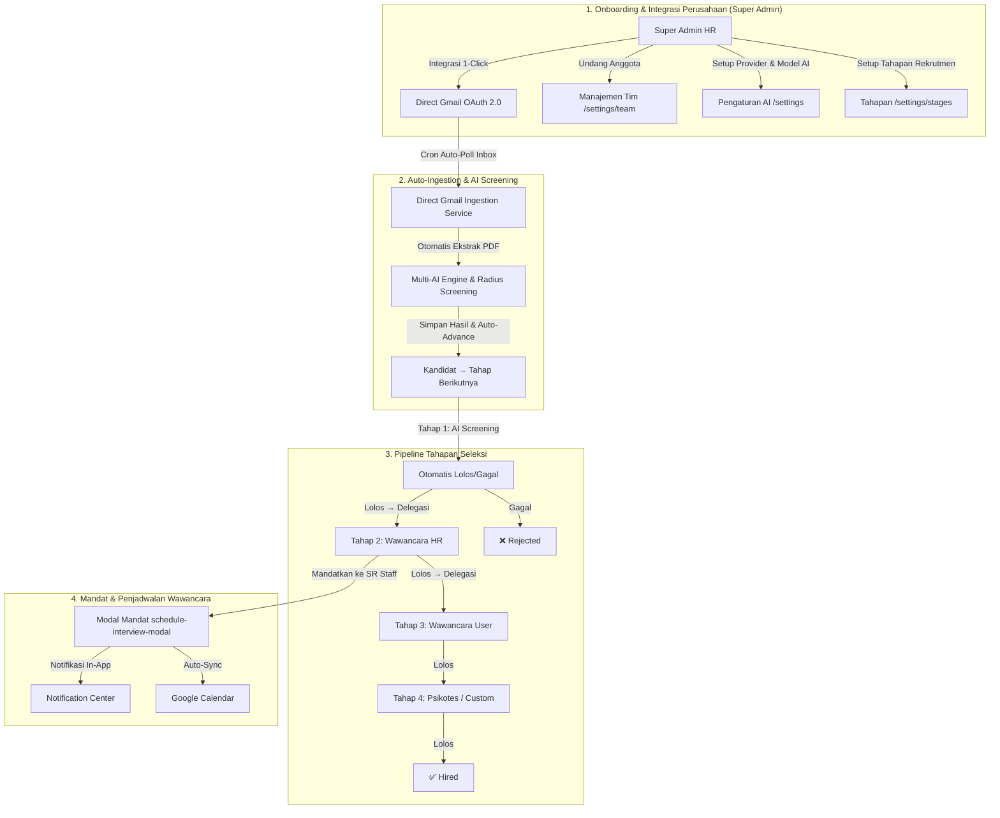

# Agent 1: Tasks To Do (Daftar Task Belum Dikerjakan)

Dokumen ini memuat **rincian task tingkat granular (detail)** untuk sistem **Multi-Role Perusahaan (Super Admin vs Recruiter SR Staff)**, **Integrasi Direct Gmail 1-Click (Tanpa Script)**, **Sistem Tahapan Rekrutmen Kustom**, **Sistem Mandat Wawancara & Notifikasi In-App**, serta **Integrasi Google Calendar Per-User**.

---

## 🗺️ Peta Arsitektur Sistem & Workflow Terintegrasi

---

## 🎉 Status Task Saat Ini

*Seluruh task dalam daftar rencana (Phase 1, Phase 2, & Phase 3) telah selesai 100% dikerjakan, diuji, dan dipindahkan ke `tasks_done.md`.*

---

## 🚀 Ringkasan Modul yang Telah Selesai:

1. **Fitur Tahapan Rekrutmen Kustom (Custom Pipeline Stages):**
   - Halaman Manajemen Tahapan Default (`/settings/stages`).
   - Opsi Override per Lowongan (`/jobs/create`).
   - Stepper Header & Kolom Tahapan Dinamis pada Pipeline (`/jobs/[jobId]`).
   - Stepper Progress, Action Buttons (Advance/Reject), & Timeline Log pada Detail Kandidat (`/candidates/[candidateId]`).
   - Skema database Supabase PostgreSQL & RLS Policies (`recruitment_stages`, `job_stages`, `candidate_stage_history`).
   - API Routes: `/api/stages`, `/api/jobs/[jobId]/stages`, `/api/candidates/[candidateId]/advance`, `/api/candidates/[candidateId]/reject`, `/api/candidates/[candidateId]/stage-history`.

2. **Manajemen Tim & Penugasan Mandat:**
   - API Manajemen Tim Perusahaan (`/api/team`, `/api/team/[memberId]`).
   - API Penugasan Mandat & Penjadwalan Wawancara (`/api/interviews`).
   - API Pusat Notifikasi In-App (`/api/notifications`).
   - API Notifikasi Email Kandidat (`/api/candidates/[candidateId]/notify`).
   - API Bulk Candidate Operations (`/api/candidates/bulk-update`).

3. **Auto-Ingestion & Google Integration:**
   - Direct Gmail Auto-Ingestion Poller & Cron (`/api/cron/gmail-ingest`, `src/lib/gmail-poller.ts`).
   - Integrasi Google Calendar Sync (`src/lib/google-calendar.ts`).
   - Multi-File Attachment Ingestion pada Webhook (`/api/webhook/ingest`).
