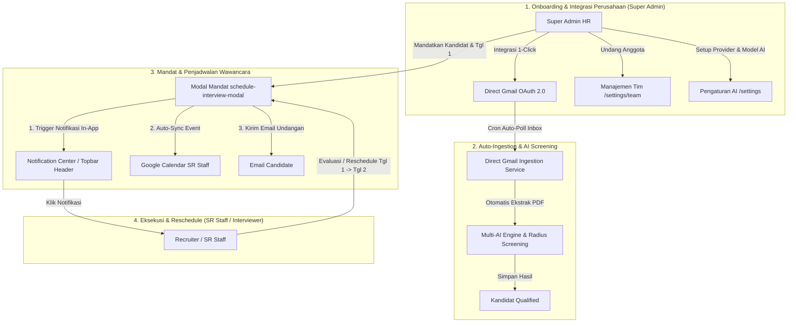

# Agent 1: Tasks To Do (Daftar Task Belum Dikerjakan)

Dokumen ini memuat **rincian task tingkat granular (detail)** yang dirancang untuk pengembangan sistem **Multi-Role Perusahaan (Super Admin vs Recruiter SR Staff)**, **Integrasi Direct Gmail 1-Click (Tanpa Script)**, **Sistem Mandat Wawancara & Notifikasi In-App**, serta **Integrasi Google Calendar Per-User**.

Setiap task dipecah secara kecil dan terfokus (maksimal 1 halaman/1 API/1 komponen per task) untuk menjaga **konteks pengerjaan AI tetap kecil, terukur, dan 100% presisi**.

---

## 🗺️ Peta Arsitektur Sistem & Workflow Terintegrasi

---

## 🚀 Phase 1: Frontend Pages & Components (Max 1 Page/Part Per Task)

### Task 1.1: Halaman Manajemen Tim Perusahaan (`/settings/team`)
- **Halaman Target:** `/settings/team`
- **Tipe:** Frontend Page (Khusus Super Admin)
- **Rincian Fitur:**
  - Form Undang Anggota Tim Baru via Email & Select Role (`Super Admin` vs `Recruiter / SR Staff`).
  - Tabel Daftar Anggota Tim Perusahaan (Nama, Email, Role Badge, Tanggal Bergabung, Status Undangan).
  - Modal Edit Role Anggota Tim & Tombol Pencabutan Akses (Revoke Access).

### Task 1.2: Halaman Integrasi Email & Kalender (`/settings/integrations`)
- **Halaman Target:** `/settings/integrations` (atau Tab Integrasi di `/settings`)
- **Tipe:** Frontend Page
- **Rincian Fitur:**
  - **Seksi 1 (Super Admin):** Card **Direct Gmail Integration (1-Click OAuth 2.0)**.
    - Tombol "Hubungkan Gmail Perusahaan" (Memicu Google Consent Screen scope `gmail.readonly`).
    - Status Koneksi (Terhubung / Belum Terhubung), Alamat Email Aktif, & Tombol Disconnect.
    - Tab Fallback Skrip Apps Script v4 untuk opsi manual jika diinginkan.
  - **Seksi 2 (Semua User / SR Staff):** Card **Google Calendar Connection**.
    - Tombol "Hubungkan Google Calendar Saya" (OAuth scope `calendar.events`).
    - Indikator Status Terhubung & Email Kalender Pengguna.

### Task 1.3: Header Notification Center Component (`notification-popover.tsx`)
- **Komponen Target:** `src/components/layout/notification-popover.tsx`
- **Tipe:** UI Component (Header Topbar)
- **Rincian Fitur:**
  - Tombol Ikon Lonceng Notifikasi di Topbar Header dengan *Unread Count Badge*.
  - Popover Dropdown List Notifikasi In-App:
    - Notifikasi penugasan mandat kandidat baru ke SR Staff.
    - Notifikasi jadwal wawancara baru.
    - Notifikasi perubahan tanggal wawancara (Reschedule dari Tanggal 1 ke Tanggal 2).
  - Klik pada notifikasi langsung mengarahkan user ke halaman detail kandidat terkait.

### Task 1.4: Modal Penugasan Mandat & Penjadwalan Wawancara (`schedule-interview-modal.tsx`)
- **Komponen Target:** `src/components/ui/schedule-interview-modal.tsx`
- **Tipe:** Interactive Modal Component
- **Rincian Fitur:**
  - Select Dropdown Pilih Anggota Tim SR Staff yang Diberikan Mandat (*Assignee*).
  - Date & Time Picker untuk Jadwal Wawancara.
  - Input Lokasi Ruangan / Link Google Meet Wawancara.
  - Mode **Reschedule** (Ubah Jadwal dari Tanggal 1 ke Tanggal 2).
  - Checkbox Sinkronkan Otomatis ke Google Calendar SR Staff.

### Task 1.5: Refinement Pipeline Kandidat & Action Massal (`/jobs/[jobId]` - Part 4)
- **Halaman Target:** `/jobs/[jobId]`
- **Tipe:** Frontend Page Enhancement
- **Rincian Fitur:**
  - Kolom Badge Penugasan (*Assigned SR Staff*) pada tabel kandidat.
  - Filter tabel kandidat berdasarkan SR Staff yang ditugaskan.
  - Fitur **Export to CSV / Excel** untuk data kandidat lowongan.
  - Multi-select checkbox untuk **Bulk Status Update** & **Bulk Assign Mandat**.

### Task 1.6: Refinement Profil Kandidat & Catatan Wawancara (`/candidates/[candidateId]` - Part 2)
- **Halaman Target:** `/candidates/[candidateId]`
- **Tipe:** Frontend Page Enhancement
- **Rincian Fitur:**
  - Card Informasi Penugasan Mandat SR Staff & Status Jadwal Wawancara.
  - Tombol Aksi Cepat: **Beri Mandat / Ubah Jadwal Wawancara** (Membuka `schedule-interview-modal.tsx`).
  - Section Catatan Internal HRD & Hasil Evaluasi Wawancara (*HR Notes & Evaluation Comments*).
  - Cetak Ringkasan Profil & Skor AI ke Dokumen PDF.

### Task 1.7: Dashboard Widget Personal SR Staff (`/dashboard` - Part 2)
- **Halaman Target:** `/dashboard`
- **Tipe:** Frontend Page Enhancement
- **Rincian Fitur:**
  - Widget Personal **"Jadwal Wawancara Saya Hari Ini"** khusus untuk user Recruiter / SR Staff.
  - Visualisasi Grafik Tren Pelamar Bulanan & Donut Distribution Kelulusan.
  - Filter rentang waktu statistik analytics.

---

## ⚙️ Phase 2: Backend APIs, Database Schemas & OAuth Routes

### Task 2.1: Migrasi Skema Database Multi-Role, Integrasi Gmail, Notifikasi & Calendar Tokens
- **File Migrasi:** `supabase/migrations/20260802000000_add_roles_gmail_notifications.sql`
- **Tipe:** Database Schema & RLS
- **Rincian Fitur:**
  - Edit `profiles`: Tambah kolom `role` (`super_admin` | `recruiter`), `gmail_connected` (boolean), `gmail_address` (text).
  - Tabel `team_invitations`: `id`, `company_id`, `email`, `role`, `token`, `status`, `created_at`.
  - Tabel `candidate_assignments`: `id`, `candidate_id`, `assigned_to_user_id`, `assigned_by_user_id`, `scheduled_at`, `location`, `notes`, `status`, `created_at`.
  - Tabel `notifications`: `id`, `user_id`, `title`, `message`, `link`, `is_read`, `created_at`.
  - Tabel `google_tokens`: `id`, `user_id`, `provider_type` (`gmail` | `calendar`), `access_token`, `refresh_token`, `scope`, `expires_at`.
  - Kebijakan RLS: Super Admin mengakses seluruh data perusahaan; Recruiter SR Staff mengakses data perusahaan & kandidat yang dimandatkan kepadanya.

### Task 2.2: OAuth 2.0 Auth Callback Routes (`/api/auth/google/callback`)
- **API Target:** `/api/auth/google/connect` & `/api/auth/google/callback`
- **Tipe:** Backend API Route (OAuth)
- **Rincian Fitur:**
  - Endpoint pemroses callback Google OAuth 2.0 untuk Direct Gmail (`gmail.readonly`) dan Google Calendar (`calendar.events`).
  - Menyimpan & mengenkripsi `refresh_token` dan `access_token` ke tabel `google_tokens`.

### Task 2.3: API Manajemen Tim Perusahaan (`/api/team`)
- **API Target:** `/api/team` & `/api/team/invite`
- **Tipe:** Backend API Route (Khusus Super Admin)
- **Rincian Fitur:**
  - Endpoint GET list anggota tim perusahaan.
  - Endpoint POST mengundang anggota baru via token email.
  - Endpoint PATCH/DELETE untuk mengubah role atau mencabut akses anggota tim.

### Task 2.4: API Pusat Notifikasi In-App (`/api/notifications`)
- **API Target:** `/api/notifications`
- **Tipe:** Backend API Route
- **Rincian Fitur:**
  - Endpoint GET daftar notifikasi user yang sedang login.
  - Endpoint PATCH mark notification as read.
  - Helper internal `createNotification()` untuk mengirim notifikasi in-app saat ada penugasan mandat atau reschedule jadwal.

### Task 2.5: API Penugasan Mandat & Penjadwalan Wawancara (`/api/interviews`)
- **API Target:** `/api/interviews`
- **Tipe:** Backend API Route
- **Rincian Fitur:**
  - Endpoint POST/PATCH untuk memberikan mandat ke SR Staff, menetapkan tanggal wawancara, atau mengubah jadwal (Reschedule Tanggal 1 -> Tanggal 2).
  - Otomatis memicu pembuat notifikasi in-app, sinkronisasi Google Calendar event, dan email pemberitahuan.

### Task 2.6: API Notifikasi Email Kandidat (`/api/candidates/[candidateId]/notify`)
- **API Target:** `/api/candidates/[candidateId]/notify`
- **Tipe:** Backend API Route
- **Rincian Fitur:** Endpoint pengiriman email panggilan wawancara / penolakan ke kandidat via Nodemailer / Resend.

### Task 2.7: API Bulk Candidate Actions (`/api/candidates/bulk-update`)
- **API Target:** `/api/candidates/bulk-update`
- **Tipe:** Backend API Route
- **Rincian Fitur:** Endpoint batch update status kandidat & penugasan mandat massal.

---

## 🤖 Phase 3: Automated Ingestion Services & Calendar Sync

### Task 3.1: Direct Gmail Auto-Ingestion Cron & Poller Service (`/api/cron/gmail-ingest`)
- **File/API Target:** `/api/cron/gmail-ingest` & `src/lib/gmail-poller.ts`
- **Tipe:** Ingestion Background Service
- **Rincian Fitur:**
  - Service pemantau pesan Gmail otomatis menggunakan Gmail API (`users.messages.list` & `users.messages.get`).
  - Pembaruan token otomatis (*Auto Refresh Token*) menggunakan `refresh_token` di `google_tokens`.
  - Mencari email unread yang memiliki lampiran CV PDF untuk akun Gmail perusahaan terhubung.
  - Mencocokkan penerima/subjek email dengan lowongan aktif, mengekstrak lampiran PDF, memanggil `analyzeCandidate()`, dan menyimpan kandidat secara otomatis — **tanpa perlu setup Apps Script manual!**

### Task 3.2: Layanan Integrasi Google Calendar API (`src/lib/google-calendar.ts`)
- **File Target:** `src/lib/google-calendar.ts`
- **Tipe:** Integration Helper Service
- **Rincian Fitur:**
  - Fungsi `createCalendarEvent()`: Membuat event wawancara otomatis di Google Calendar SR Staff.
  - Fungsi `updateCalendarEvent()`: Mengubah tanggal/waktu event secara otomatis saat terjadi reschedule (misal dari Tanggal 1 ke Tanggal 2).
  - Fungsi `deleteCalendarEvent()`: Menghapus event saat wawancara dibatalkan.

### Task 3.3: Support Multi-File Attachment Ingestion
- **Tipe:** Enhancement Ingestion Service
- **Rincian Fitur:** Pembacaan beberapa file dokumen sekaligus (CV + Portofolio + Surat Lamaran) dari email/form publik.
