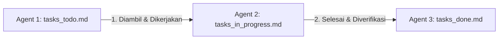

# Agent 1: Tasks To Do (Daftar Task Belum Dikerjakan)

Dokumen ini berisi daftar **rencana task pengembangan mendatang** yang akan dikerjakan secara bertahap. 

Setiap task dirancang secara terfokus (maksimal 1 halaman/komponen spesifik per task) agar **konteks pengerjaan AI tidak terlalu besar dan hasil eksekusinya presisi & akurat**.

---

## Alur Perpindahan Task (Kanban Workflow)

---

## 🚀 Phase 1: Frontend Enhancements (Tiap Task Maksimal 1 Halaman)

### Task 1.1: Refinement Halaman Candidate Pipeline (`/jobs/[jobId]` - Part 4)
- **Halaman Target:** `/jobs/[jobId]`
- **Cakupan Fitur:**
  - Fitur **Export to CSV / Excel** untuk mengunduh daftar kandidat dalam satu lowongan beserta skor AI dan statusnya.
  - Multi-select checkbox pada tabel kandidat untuk melakukan **Bulk Status Update** (misal: Mengubah 10 kandidat sekaligus menjadi 'Ready to Interview' atau 'Rejected').
  - Pencarian kata kunci cepat pada tabel kandidat (Search by Name / Email / Skill).

### Task 1.2: Refinement Halaman Detail Kandidat (`/candidates/[candidateId]` - Part 2)
- **Halaman Target:** `/candidates/[candidateId]`
- **Cakupan Fitur:**
  - Fitur **Catatan Internal HR (HR Notes & Comments)** di bagian bawah profil kandidat.
  - Tombol **Print / Export PDF Summary** untuk mencetak rangkuman profil kandidat & hasil skor AI secara rapi.
  - Fitur **Kirim Email Notifikasi Langsung** ke kandidat (Template email Panggilan Wawancara / Penolakan).

### Task 1.3: Refinement Halaman Main Dashboard Analytics (`/dashboard` - Part 2)
- **Halaman Target:** `/dashboard`
- **Cakupan Fitur:**
  - Visualisasi Grafik Batang / Garis (Chart.js atau Recharts) untuk tren pelamar bulanan.
  - Distribution Donut Chart untuk persentase kelulusan kandidat (Qualified vs Not Qualified vs Pending).
  - Filter rentang waktu statistik (7 hari terakhir, 30 hari terakhir, Semua waktu).

---

## ⚙️ Phase 2: Backend APIs, Notifications & Database

### Task 2.1: API Notifikasi Email Kandidat (`/api/candidates/[candidateId]/notify`)
- **Halaman/API Target:** `/api/candidates/[candidateId]/notify`
- **Cakupan Fitur:**
  - Endpoint Serverless untuk mengirimkan email balasan ke kandidat via Nodemailer / Resend API.
  - Template email otomatis untuk status 'Ready to Interview' (Undangan Wawancara) dan 'Rejected' (Surat Penolakan Sopan).
  - Pencatatan log riwayat pengiriman email pada tabel candidates.

### Task 2.2: API Bulk Candidate Actions (`/api/candidates/bulk-update`)
- **Halaman/API Target:** `/api/candidates/bulk-update`
- **Cakupan Fitur:**
  - Endpoint POST untuk menerima array `candidate_ids` dan `new_status`.
  - Transaksi database batch update di Supabase.
  - Respon status sukses & error per kandidat.

---

## 🤖 Phase 3: Advanced Automation & Integrations

### Task 3.1: Support Multi-File Attachment Ingestion
- **Cakupan Fitur:**
  - Pembaruan skrip Google Apps Script & API Webhook Ingest untuk mendukung pengiriman beberapa file sekaligus (misal: CV + Surat Lamaran + Portfolio).
  - Pembacaan & konsolidasi teks dari dokumen pendukung oleh AI Engine.
