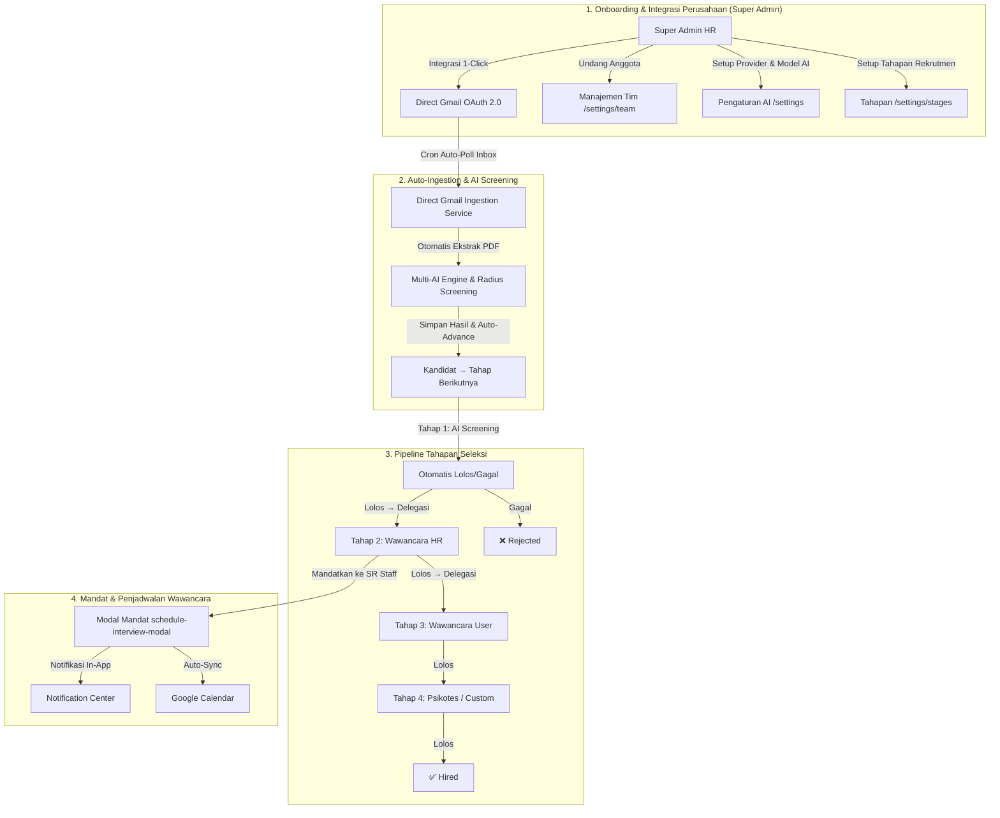

# Agent 1: Tasks To Do (Daftar Task Belum Dikerjakan)

Dokumen ini memuat **rincian task tingkat granular (detail)** yang dirancang untuk pengembangan sistem **Multi-Role Perusahaan (Super Admin vs Recruiter SR Staff)**, **Integrasi Direct Gmail 1-Click (Tanpa Script)**, **Sistem Tahapan Rekrutmen Kustom**, **Sistem Mandat Wawancara & Notifikasi In-App**, serta **Integrasi Google Calendar Per-User**.

Setiap task dipecah secara kecil dan terfokus (maksimal 1 halaman/1 API/1 komponen per task) untuk menjaga **konteks pengerjaan AI tetap kecil, terukur, dan 100% presisi**.

---

## 🗺️ Peta Arsitektur Sistem & Workflow Terintegrasi

---

## 🚀 Phase 1: Frontend Pages & Components (Max 1 Page/Part Per Task)

### ⚡ Task 1.16: Halaman Pengaturan Tahapan Rekrutmen (`/settings/stages`) — NEW
- **Halaman Target:** `src/app/(dashboard)/settings/stages/page.tsx`
- **Tipe:** Frontend Page (Khusus Super Admin)
- **Prioritas:** 🔴 Tinggi (Fondasi fitur baru)
- **Rincian Fitur:**
  - **Daftar Tahapan Default Perusahaan:** Sortable list setiap tahapan (nama, deskripsi singkat, urutan, warna).
  - **Tombol Tambah Tahapan:** Modal input nama tahapan baru + deskripsi + warna opsional.
  - **Edit & Hapus Tahapan:** Inline edit nama tahapan, tombol delete dengan konfirmasi (tahap `is_system=true` tidak bisa dihapus).
  - **Preview Alur:** Visualisasi horizontal stepper dari Apply → Tahap 1 → Tahap 2 → ... → Hired/Rejected.
  - **Tahap Pertama Bawaan:** "Apply & AI Screening" adalah tahap pertama bawaan (`is_system=true`) yang tidak bisa dihapus.
  - **Tab Navigasi:** Tambah tab "Tahapan Rekrutmen" di sub-nav settings (sebelah Profil/AI, Tim, Integrasi).

### ⚡ Task 1.17: Revisi Buat Lowongan — Opsi Override Tahapan (`/jobs/create` Revisi) — REVISION
- **Halaman Target:** `src/app/(dashboard)/jobs/create/page.tsx`
- **Tipe:** Frontend Page Enhancement (Revisi Task 1.4)
- **Prioritas:** 🟡 Medium
- **Rincian Fitur:**
  - **Section Baru "Tahapan Seleksi":** Di bawah kriteria, tampilkan pilihan:
    - **Radio 1 (Default):** "Gunakan Tahapan Default Perusahaan" → Preview readonly stepper dari template.
    - **Radio 2 (Custom):** "Kustomisasi Tahapan untuk Lowongan Ini" → Form reorder/tambah/hapus tahapan khusus.
  - **Delegasi Per-Tahap:** Setiap tahapan bisa di-assign default PIC (SR Staff).

### ⚡ Task 1.18: Revisi Pipeline Kandidat — Kolom Tahapan Dinamis (`/jobs/[jobId]` Revisi) — REVISION
- **Halaman Target:** `src/app/(dashboard)/jobs/[jobId]/page.tsx`
- **Tipe:** Frontend Page Revision (Revisi Task 1.5 & 1.13)
- **Prioritas:** 🟡 Medium
- **Rincian Fitur:**
  - **Stepper Progress Bar Header:** Mini stepper horizontal menunjukkan distribusi kandidat per tahapan.
  - **Kolom "Tahapan Saat Ini":** Badge tahapan dinamis (nama + warna) menggantikan status hardcoded.
  - **Filter Tahapan Dropdown:** Filter kandidat per tahapan spesifik.
  - **Tombol "Naikkan Tahapan" / "Tolak":** Per-baris aksi untuk memajukan atau menolak kandidat.
  - **Bulk Action Revisi:** Bulk "Naikkan Tahapan" & Bulk "Tolak".

### ⚡ Task 1.19: Revisi Detail Kandidat — Stepper & Status Dinamis (`/candidates/[candidateId]` Revisi) — REVISION
- **Halaman Target:** `src/app/(dashboard)/candidates/[candidateId]/page.tsx`
- **Tipe:** Frontend Page Revision (Revisi Task 1.7 & 1.14)
- **Prioritas:** 🟡 Medium
- **Rincian Fitur:**
  - **Stepper Progress Kandidat:** Visualisasi horizontal (tahap sebelumnya ✅, saat ini 🔵, berikutnya ⚪).
  - **Dropdown Status Dinamis:** Dari pipeline lowongan, bukan hardcoded.
  - **Card Info Tahapan Aktif:** Nama tahapan saat ini, PIC ditugaskan, tanggal masuk tahapan.
  - **Riwayat Perpindahan Tahapan:** Timeline log kapan kandidat masuk/keluar setiap tahapan + siapa yang memproses.

---

## ⚙️ Phase 2: Backend APIs, Database Schemas & OAuth Routes

### ⚡ Task 2.8: Migrasi Database Tahapan Rekrutmen — NEW
- **File Migrasi:** `supabase/migrations/YYYYMMDD_add_recruitment_stages.sql`
- **Tipe:** Database Schema & RLS
- **Prioritas:** 🔴 Tinggi (Fondasi backend)
- **Rincian Fitur:**
  - **Tabel `recruitment_stages`** (Template default per perusahaan):
    - `id` UUID PK, `company_id` UUID FK→profiles.id, `name` text NOT NULL, `description` text, `order_index` int NOT NULL, `color` text, `is_system` boolean DEFAULT false, `created_at` timestamptz.
  - **Tabel `job_stages`** (Override per lowongan, opsional):
    - `id` UUID PK, `job_id` UUID FK→jobs.id, `name` text NOT NULL, `description` text, `order_index` int NOT NULL, `color` text, `default_assignee_id` UUID FK→profiles.id (nullable), `created_at` timestamptz.
  - **Update tabel `candidates`:**
    - Tambah `current_stage_id` UUID FK (nullable).
    - Tambah `current_stage_name` text (denormalized).
  - **Update tabel `jobs`:**
    - Tambah `use_custom_stages` boolean DEFAULT false.
  - **Tabel `candidate_stage_history`:**
    - `id` UUID PK, `candidate_id` UUID FK, `from_stage_name` text, `to_stage_name` text, `changed_by_user_id` UUID FK, `notes` text, `created_at` timestamptz.
  - **RLS Policies & Seed Data:** Tahapan default bawaan "Apply & AI Screening" (is_system=true), "Review HR", "Diterima".

### ⚡ Task 2.9: API CRUD Tahapan Rekrutmen Default (`/api/stages`) — NEW
- **API Target:** `/api/stages`
- **Tipe:** Backend API Route (Khusus Super Admin)
- **Prioritas:** 🔴 Tinggi
- **Rincian Fitur:**
  - GET list tahapan default perusahaan (sorted by order_index).
  - POST tambah tahapan baru.
  - PATCH update nama/deskripsi/order.
  - DELETE hapus tahapan (hanya `is_system = false`).
  - POST `/api/stages/reorder` batch update urutan.

### ⚡ Task 2.10: API Tahapan Per Lowongan (`/api/jobs/[jobId]/stages`) — NEW
- **API Target:** `/api/jobs/[jobId]/stages`
- **Tipe:** Backend API Route
- **Prioritas:** 🟡 Medium
- **Rincian Fitur:**
  - GET tahapan efektif lowongan (custom jika ada, fallback default).
  - POST copy tahapan default ke `job_stages` untuk override.
  - PATCH/DELETE update/hapus tahapan spesifik lowongan.

### ⚡ Task 2.11: API Perpindahan Tahapan Kandidat (`/api/candidates/[candidateId]/advance`) — NEW
- **API Target:** `/api/candidates/[candidateId]/advance` & `/api/candidates/[candidateId]/reject`
- **Tipe:** Backend API Route
- **Prioritas:** 🟡 Medium
- **Rincian Fitur:**
  - POST advance: Naikkan ke tahapan berikutnya (auto-detect next by order_index).
  - POST reject: Tolak di tahapan manapun.
  - Insert log ke `candidate_stage_history`.
  - Trigger notifikasi in-app ke PIC tahapan berikutnya.
  - Update `candidates.current_stage_id` & `current_stage_name`.

---

## ⚙️ Phase 2 (Existing — Belum Dikerjakan)

### Task 2.3: API Manajemen Tim Perusahaan (`/api/team`)
- **API Target:** `/api/team` & `/api/team/invite`
- **Tipe:** Backend API Route (Khusus Super Admin)
- **Rincian Fitur:**
  - Endpoint GET list anggota tim perusahaan.
  - Endpoint POST mengundang anggota baru via token email.
  - Endpoint PATCH/DELETE untuk mengubah role atau mencabut akses anggota tim.

### Task 2.4: API Pusat Notifikasi In-App (`/api/notifications`)
- **API Target:** `/api/notifications`
- **Tipe:** Backend API Route
- **Rincian Fitur:**
  - Endpoint GET daftar notifikasi user yang sedang login.
  - Endpoint PATCH mark notification as read.
  - Helper internal `createNotification()` untuk mengirim notifikasi in-app.

### Task 2.5: API Penugasan Mandat & Penjadwalan Wawancara (`/api/interviews`)
- **API Target:** `/api/interviews`
- **Tipe:** Backend API Route
- **Rincian Fitur:**
  - Endpoint POST/PATCH untuk memberikan mandat, menetapkan jadwal, atau reschedule.
  - Otomatis memicu notifikasi in-app, Google Calendar sync, dan email.

### Task 2.6: API Notifikasi Email Kandidat (`/api/candidates/[candidateId]/notify`)
- **API Target:** `/api/candidates/[candidateId]/notify`
- **Tipe:** Backend API Route
- **Rincian Fitur:** Pengiriman email panggilan wawancara / penolakan ke kandidat.

### Task 2.7: API Bulk Candidate Actions (`/api/candidates/bulk-update`)
- **API Target:** `/api/candidates/bulk-update`
- **Tipe:** Backend API Route
- **Rincian Fitur:** Batch update status/tahapan kandidat & penugasan mandat massal.

---

## 🤖 Phase 3: Automated Ingestion Services & Calendar Sync

### Task 3.1: Direct Gmail Auto-Ingestion Cron & Poller Service (`/api/cron/gmail-ingest`)
- **File/API Target:** `/api/cron/gmail-ingest` & `src/lib/gmail-poller.ts`
- **Tipe:** Ingestion Background Service
- **Rincian Fitur:**
  - Service pemantau pesan Gmail otomatis menggunakan Gmail API.
  - Auto Refresh Token.
  - Mencocokkan email dengan lowongan aktif, mengekstrak PDF, memanggil `analyzeCandidate()`.
  - **Auto-advance:** Kandidat yang lolos AI screening otomatis naik ke tahap berikutnya.

### Task 3.2: Layanan Integrasi Google Calendar API (`src/lib/google-calendar.ts`)
- **File Target:** `src/lib/google-calendar.ts`
- **Tipe:** Integration Helper Service
- **Rincian Fitur:**
  - `createCalendarEvent()`, `updateCalendarEvent()`, `deleteCalendarEvent()`.

### Task 3.3: Support Multi-File Attachment Ingestion
- **Tipe:** Enhancement Ingestion Service
- **Rincian Fitur:** Pembacaan beberapa file dokumen sekaligus dari email/form publik.
